# 🐾 StrayTrack

StrayTrack is a smart, Flutter-based app designed to assist municipal corporations in managing the pickup, sterilization (ABC process), and safe return of stray dogs to their original locations. It ensures compassionate treatment, transparency, and accountability through a fully digital and efficient system.

---

## 🔍 Problem Statement

After sterilization, stray dogs are often left in unfamiliar areas due to lack of coordination, which can lead to distress and disorientation. This issue stems from inefficient tracking methods in municipal operations.

---

## 🌟 Solution

- 📖 **Centralized Dog Records** – Track every dog with a unique ID  
- 🚐 **Pickup & Drop Module** – Real-time updates with photos and location  
- 🏥 **ABC Center Management** – Monitor capacity ,admission status and track disease outbreaks across localities
- 📊 **Report & Analysis** – Visual trends, charts, and hotspot mapping  
 
---

## 📱 App Screenshots

### 🐕 Dogs Record Module

  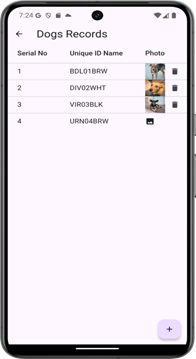
  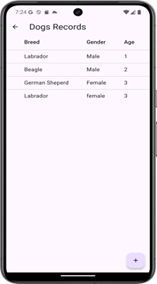
  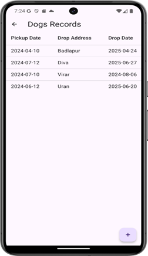

---

### 🚐 Pickup Tracking

  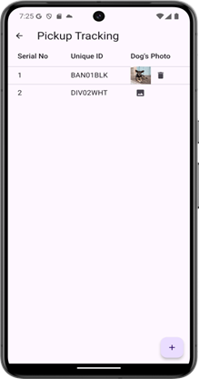
  
  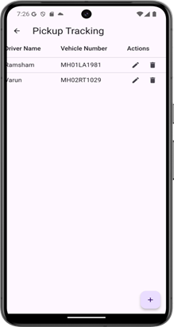

  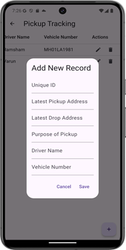

---

### 🏥 ABC Center Management

  
  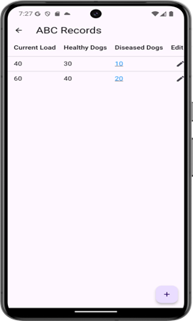
  

  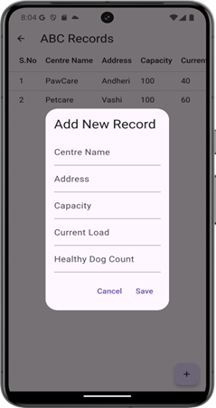

  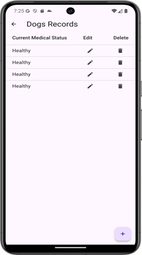
  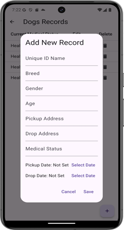
  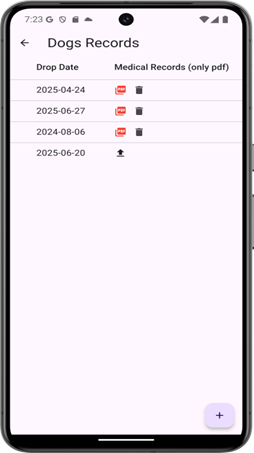

---

### 📊 Reports & Hotspot Analysis

  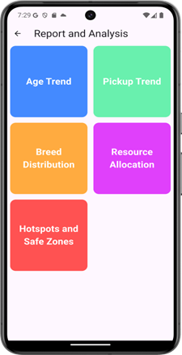
  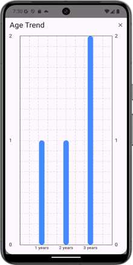
  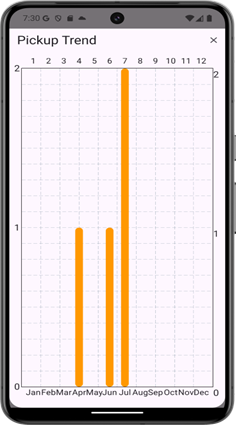

  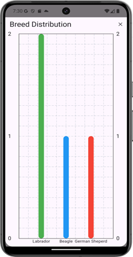
  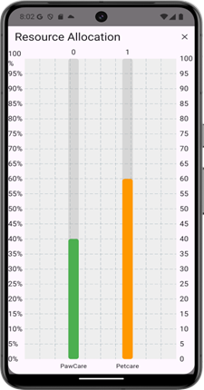
  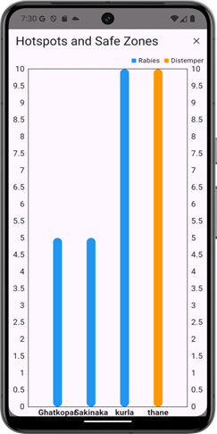

---

## 🌍 Market Relevance

Over 4,000+ urban local bodies in India face challenges with stray dog management. This app is scalable, low-cost, and tailored for civic use — making it viable for wide adoption across cities and NGOs.

---

## 💼 Economic & Environmental Impact

- 💰 Cost-effective: no hardware needed, app-based system  
- 🔄 Reduces manual errors, saves time, builds public trust  
- 🌱 Helps identify diseased dogs and control outbreaks, supporting public health and hygiene  

---

## 🛠 Tech Stack

- Flutter (Frontend)  
- Firebase (Database)  
- Dropbox (Temporary media storage)  
- `.env` for managing secret API keys  

---
## 🚀 How to Run

1. Clone the repo  
2. Add your `.env` file with `DROPBOX_KEY`  
3. Place `google-services.json` in `android/app`  
4. Run `flutter pub get`  
5. Launch with `flutter run`

---

## 🔒 Security Notice

✅ API keys moved to `.env`  
✅ `google-services.json` added to `.gitignore`

---
## 🧑‍💻 Developer

Built with ❤️ by **Pratiksha Zodge**  
Third Year Computer Engineering Student  
GitHub: [@Pratiksha575-dev](https://github.com/Pratiksha575-dev)

---
